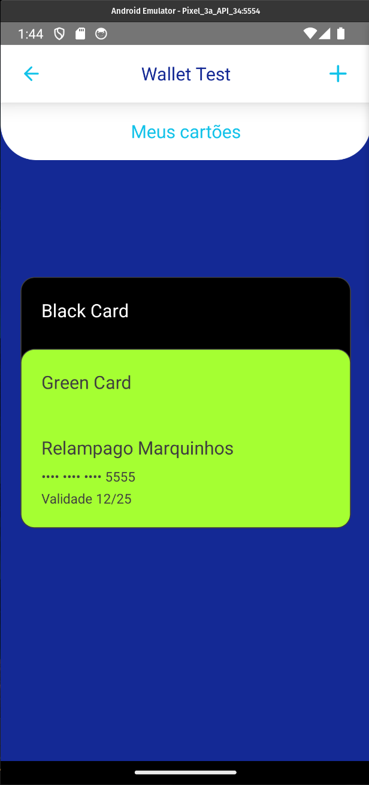

# WalletTest

Bem-vindo ao projeto **WalletTest**! Este é um aplicativo desenvolvido em React Native a fim de resolver um test pático para posição de Frontend mobile.

<div style="display: flex; flex-direction: row;">


</div>

## Principais tecnologias utilizadas

- **React Native** 0.74.3: Framework para construir aplicativos móveis nativos utilizando React.
- **React** 18.2.0: Biblioteca para criar interfaces de usuário.
- **Styled Components** 6.1.12: Biblioteca para estilização de componentes usando CSS-in-JS.
- **React Navigation**: Navegação entre telas e stacks no aplicativo.
  - @react-navigation/native 6.1.18
  - @react-navigation/native-stack 6.11.0
- **Axios** 1.7.2: Cliente HTTP para fazer requisições à API.
- **Yup** 1.4.0: Validação de esquemas para JavaScript.
- **React Hook Form** 7.52.1: Gerenciamento de formulários de maneira fácil e eficaz.
- **Json Server** 1.0.0-beta.1: Criação de uma API REST falsa rapidamente.
- **Eslint** 8.19.0: Linter para encontrar e corrigir problemas em seu código JavaScript.
- **Jest** 29.6.3: Framework de testes para garantir a funcionalidade do aplicativo.
- **React Native Reanimated** 3.14.0: Biblioteca para animações no React Native.

## Pré-requisitos

Antes de começar, certifique-se de ter as seguintes ferramentas instaladas em seu ambiente:

- **Node.js**: Versão 18 ou superior
- **Yarn**: Gerenciador de pacotes (Versão 3.6.4 ou superior)
- **Android Studio**: Para emular dispositivos Android
- **Xcode**: Para emular dispositivos iOS (somente em macOS)

## Instalação

Siga os passos abaixo para instalar as dependências do projeto:

1. Clone o repositório para o seu ambiente local:

   ```bash
   git clone https://github.com/seu-usuario/WalletTest.git
   cd WalletTest
   ```

2. Instale as dependências do projeto usando o Yarn:

   ```bash
   yarn install
   ```

## Como Executar

Após a instalação das dependências, você pode iniciar o aplicativo em um emulador ou dispositivo físico. Veja como:

### Android

1. Inicie o emulador Android pelo Android Studio ou conecte um dispositivo Android via USB.

2. Execute o aplicativo:

   ```bash
   yarn android
   ```

### iOS

1. Inicie o emulador iOS pelo Xcode ou conecte um dispositivo iOS via USB.

2. Execute o aplicativo:

   ```bash
   yarn ios
   ```

### Inicializar o Servidor Local

Para inicializar o servidor local com JSON Server, use o comando abaixo:

```bash
yarn server
```

Isso irá configurar uma API REST simulada na porta `8000`.

Caso tenha problemas de conxão com a api local no emulador android, basta executar o seguinte comando:

```bash
  adb reverse tcp:8000 tcp:8000
```

### Outros Scripts

- **Iniciar o Metro Bundler**:  
  Use este comando para iniciar o servidor Metro separadamente, se necessário.

  ```bash
  yarn start
  ```

- **Executar Linter**:  
  Verifique e corrija problemas de estilo de código.

  ```bash
  yarn lint
  ```

- **Executar Testes**:  
  Execute todos os testes unitários definidos no projeto.

  ```bash
  yarn test
  ```

## Relatório de Cobertura de Testes

### Estatísticas Gerais

| Tipo          | Total | Cobertos | Não Cobertos | Cobertura (%) |
| ------------- | ----- | -------- | ------------ | ------------- |
| 🟢 Lines      | 232   | 217      | 15           | 93.53%        |
| 🟢 Statements | 239   | 224      | 15           | 93.72%        |
| 🟢 Functions  | 88    | 81       | 7            | 92.04%        |
| 🟢 Branches   | 68    | 65       | 3            | 95.58%        |

### Cobertura por Arquivo

| Arquivo                                             | Linhas (%) | Funções (%) | Statements (%) | Branches (%) |
| --------------------------------------------------- | ---------- | ----------- | -------------- | ------------ |
| 🟢 src/declarations.d.ts                            | 100%       | 100%        | 100%           | 100%         |
| 🟢 src/components/index.ts                          | 100%       | 100%        | 100%           | 100%         |
| 🟢 src/components/button/index.tsx                  | 100%       | 100%        | 100%           | 100%         |
| 🟢 src/components/button/styles.ts                  | 100%       | 100%        | 100%           | 100%         |
| 🟢 src/components/button/types.ts                   | 100%       | 100%        | 100%           | 100%         |
| 🟢 src/components/card/index.tsx                    | 100%       | 100%        | 100%           | 100%         |
| 🟢 src/components/card/styles.ts                    | 100%       | 100%        | 100%           | 100%         |
| 🟢 src/components/container/index.tsx               | 100%       | 100%        | 100%           | 100%         |
| 🟢 src/components/container/styles.ts               | 100%       | 100%        | 100%           | 100%         |
| 🟢 src/components/header/index.tsx                  | 100%       | 100%        | 100%           | 100%         |
| 🟡 src/components/header/styles.ts                  | 77.77%     | 50%         | 77.77%         | 100%         |
| 🟢 src/components/spacing/index.tsx                 | 100%       | 100%        | 100%           | 100%         |
| 🟢 src/components/textinput/index.tsx               | 87.5%      | 100%        | 87.5%          | 83.33%       |
| 🟢 src/components/textinput/styles.ts               | 83.33%     | 72.72%      | 83.33%         | 100%         |
| 🟢 src/components/typography/index.ts               | 100%       | 100%        | 100%           | 100%         |
| 🟢 src/context/index.tsx                            | 100%       | 100%        | 100%           | 100%         |
| 🟢 src/infra/api.ts                                 | 100%       | 100%        | 100%           | 100%         |
| 🟢 src/infra/types.ts                               | 100%       | 100%        | 100%           | 100%         |
| 🔴 src/routes/index.tsx                             | 0%         | 0%          | 0%             | 100%         |
| 🟢 src/screens/index.ts                             | 100%       | 100%        | 100%           | 100%         |
| 🟢 src/screens/finish/index.tsx                     | 100%       | 100%        | 100%           | 100%         |
| 🟢 src/screens/finish/styles.ts                     | 100%       | 100%        | 100%           | 100%         |
| 🟢 src/screens/home/index.tsx                       | 100%       | 100%        | 100%           | 100%         |
| 🟢 src/screens/home/styles.ts                       | 100%       | 100%        | 100%           | 100%         |
| 🟢 src/screens/loading/index.tsx                    | 77.77%     | 85.71%      | 78.94%         | 100%         |
| 🟢 src/screens/loading/styles.ts                    | 100%       | 100%        | 100%           | 100%         |
| 🟢 src/screens/register/index.tsx                   | 100%       | 100%        | 100%           | 100%         |
| 🟢 src/screens/register/styles.ts                   | 100%       | 100%        | 100%           | 100%         |
| 🟢 src/screens/wallet/index.tsx                     | 100%       | 100%        | 100%           | 87.5%        |
| 🟢 src/screens/wallet/styles.ts                     | 100%       | 100%        | 100%           | 100%         |
| 🟢 src/screens/wallet/components/animatedButton.tsx | 100%       | 100%        | 100%           | 100%         |
| 🟢 src/screens/wallet/components/animatedCard.tsx   | 100%       | 100%        | 100%           | 83.33%       |
| 🟢 src/screens/wallet/components/cardlist.tsx       | 100%       | 100%        | 100%           | 100%         |
| 🟢 src/themes/index.ts                              | 100%       | 100%        | 100%           | 100%         |
| 🟢 src/themes/styled.d.ts                           | 100%       | 100%        | 100%           | 100%         |
| 🟢 src/utils/commonutils.ts                         | 100%       | 100%        | 100%           | 100%         |
| 🟢 src/utils/textutils.ts                           | 100%       | 100%        | 100%           | 100%         |
